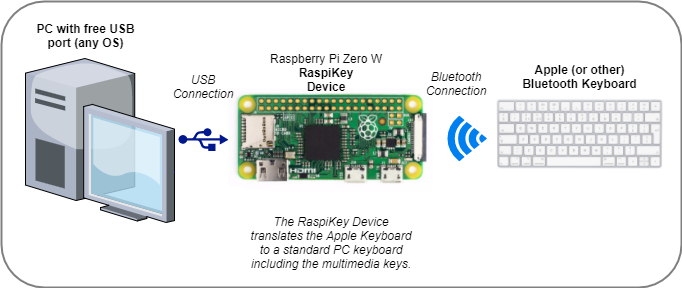

###### Universal Apple Keyboard USB Adapter

RaspiKey converts a bluetooth keyboard to a standard wired USB keyboard. It is particularly useful with the **Apple Wireless** keyboards because it translates their exotic keymap to that of a **standard PC** and makes them fully usable on a Windows PC or on other devices (TVs, game consoles, etc.).

RaspiKey requires a [Raspberry Pi Zero W](https://www.raspberrypi.org/products/raspberry-pi-zero-w/) hardware board.

Features
--------

* RaspiKey can host **any bluetooth keyboard** but it currently offers full keyboard compatibility (e.g. special multimedia keys support) only for the Apple Wireless (A1314) and the Apple Magic (A1644) keyboard models.
* **Zero software footprint**. It does not require a driver installation on the target host or other software.
* **Self-consistent**. It does not need external power. It is self-powered through the PC USB port.
* It is **secure**. As it is a hardware device, there is no software driver running on your PC that can be hacked, intercepted or compromised compared to a software solution. You even have **full access to the source code** to examine what it does or even build it yourself.
* RaspiKey **can be used on anything**; on any device that accepts a standard USB keyboard, not just on Windows PCs. This means that you can connect your Apple keyboard to your smart TV or your game console with full keyboard functionality.
* It is based on a cut-down, readonly version of the official Raspbian Linux. Even though it runs an OS internally, there is no need for a shutdown process, you just unplug it when you want.
* Supports **custom keymaps**, allowing you to customise and remap any key.

Images
------

Hardware and Software Requirements
----------------------------------

1. A plain [Raspberry Pi Zero W](https://www.raspberrypi.org/products/raspberry-pi-zero-w/) board.
2. A 2GB micro SD card.
3. Access to a modern Windows PC with the Chrome browser. You need this to build your new RaspiKey device and tether a Bluetooth keyboard to it for the first time.

Setting up a new RaspiKey Device
--------------------------------

1. Download [Apple Bonjour](https://developer.apple.com/bonjour/) and install it on Windows. The latest 32-bit and 64-bit versions are available [here](https://github.com/samartzidis/RaspiKey/tree/master/utilities).
2. Download and install [Etcher](https://etcher.io/).
3. Download the latest RaspiKey release **raspikey.zip** and the latest Raspbian headless release **...-raspbian-stretch-lite-headless.xz** from [here](https://github.com/samartzidis/RaspiKey/releases).
4. Run Etcher to write the **...-raspbian-stretch-lite-headless.xz** image to the SD card.
5. Open the downloaded **raspikey.zip** file and copy all of its contents (setup, start.sh) directly to the the SD card. The SD card should appear on Windows as a drive named **boot**.
6. Now insert the SD card to the “Raspberry Pi Zero W” device and connect it to the PC using just the middle micro-USB port (labelled “USB” in tiny white letters). The Raspberry Pi will both draw power from this port as well as use it to communicate with the PC.
7. The Pi will boot and continue the setup. This process should last about 3-4 minutes. You will be able to tell when it's finished when the Raspberry Pi's **green led turns off** (at it stays solid green during the setup process). Once that happens, unplug it from the PC's USB port.
8. Your new RaspiKey device is now fully configured and ready to use.

RaspiKey Usage
--------------

1. Plug RaspiKey to a PC.
2. Wait for about 10 seconds for it to start and open Chrome or Firefox at **[http://raspikey.local](http://raspikey.local)**. 
3. Use the configuration page to discover and connect a Bluetooth keyboard to it. Once the keyboard is connected, it will be usable on this PC directly or on anywhere else you plug RaspiKey to. You do not need to reconfigure RaspiKey to plug it in and use it elsewhere.

Known Issues
------------

*   The battery level indicator does not yet work for the Apple Magic (A1644) keyboard.
*   The Ctrl-LShift-T combination does not work on Apple keyboards, use the Ctrl-RShift-T instead where applicable.

Apple Keyboards Keymap
----------------------

<table>
    <tr>
      <th>Input Key(s)</th>
      <th>Output Key</th>
    </tr>
    <tr>
      <td><kbd>LCtrl</kbd></td><td><kbd>Fn</kbd></td>
    </tr>
    <tr>
      <td><kbd>Fn</kbd></td><td><kbd>Left Ctrl</kbd></td>
    </tr>
    <tr>
      <td><kbd>⏏︎ Eject</kbd></td><td><kbd>Del</kbd></td>
    </tr>
    <tr>
      <td><kbd>⌘ Cmd</kbd></td><td><kbd>Alt</kbd></td>
    </tr>    
    <tr>
      <td><kbd>⌥ Alt</kbd></td><td><kbd>Cmd</kbd></td>
    </tr>       
    <tr>
      <td><kbd>Fn</kbd>+<kbd>[F1]</kbd>...<kbd>[F6]</kbd></td><td><kbd>[F13]</kbd>...<kbd>[F18]</kbd></td>
    </tr>
    <tr>
      <td><kbd>Fn</kbd>+<kbd>[F7]</kbd>...<kbd>[F12]</kbd></td><td>Multimedia Keys</kbd></td>
    </tr>
    <tr>
      <td><kbd>Fn</kbd>+<kbd>LCtrl</kbd></td><td><kbd>Right Ctrl</kbd></td>
    </tr>
    <tr>
      <td><kbd>Fn</kbd>+<kbd>Return</kbd></td><td><kbd>Insert</kbd></td>
    </tr>
    <tr>
      <td><kbd>Fn</kbd>+<kbd>P</kbd></td><td><kbd>Print Screen</kbd></td>
    </tr>
    <tr>
      <td><kbd>Fn</kbd>+<kbd>S</kbd></td><td><kbd>Scroll Lock</kbd></td>
    </tr>
    <tr>
      <td><kbd>Fn</kbd>+<kbd>B</kbd></td><td><kbd>Pause/Break</kbd></td>
    </tr>
    <tr>
      <td><kbd>Fn</kbd>+<kbd>&uarr;</kbd></td><td><kbd>Page Up</kbd></td>
    </tr>
    <tr>
      <td><kbd>Fn</kbd>+<kbd>&darr;</kbd></td><td><kbd>Page Down</kbd></td>
    </tr>
    <tr>
      <td><kbd>Fn</kbd>+<kbd>&larr;</kbd></td><td><kbd>Home</kbd></td>
    </tr>
    <tr>
      <td><kbd>Fn</kbd>+<kbd>&rarr;</kbd></td><td><kbd>End</kbd></td>
    </tr>
  </table>

Custom Keymaps
--------------

- A Keymap for the **German** Apple keyboard versions so that all keys work as expected is available [here](https://raw.githubusercontent.com/samartzidis/RaspiKey/master/keymaps/de-keymap.json).

- A Keymap for the **UK** and **International English** versions is [here](https://raw.githubusercontent.com/samartzidis/RaspiKey/master/keymaps/en-uk-keymap.json). This keymap maps the <kbd>`</kbd> key to the key below <kbd>Esc</kbd> and then assigns it to the Windows <kbd>Menu ▤</kbd> key, that Apple keyboards don't have.

Planned Futures
---------------

*   Support for the full-size Apple Magic keyboard.

---
RaspiKey is a free and open-source software effort. If you like it and find it useful, please consider donating

